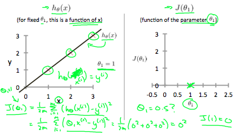

# **Machine Learning Course -1** 

## **Machine Learning**
ML is a subset of AI, In ML we build model and give it a lot of data like we give it a lots of images of cats and dogs and then our model will then find and learn patterns in input data so we can give it a new picture of cat that it has not seen before and ask it, is it cat or dog and it will tell us with certain level of accuracy. the more input data we give the more accurate our is going to be.

---
## **Machine Learning Steps**
1- Import the data which often come in the form of csv file. </br>

2- Clean the data it involves tasks such as removing duplicating data, removed irrelevant data and remove incomplete data or modify. If our data is text-based like the names of countries or genres of music we need to ceonvert them to numarical values.</br>

3- Split The data into Training/Test Sets (to make sure our model produces the right result).</br>

4- Creata a Model this involves selecting an algorithm to analyze the data. there are so many different machine learning algorithms out there such as decision trees, neural network and so on. Each algorithm has prons and cons in term of accuracy and performance so the algorithm we choose depends on the problem we are trying to solve and input data, we dont need to explicitly program and algorithm there are libraries out there that provide these algorithms the most popular one is scikit-learn. So we build a model using an algorithm.</br>

5- Train the Model. So we fitted our training data our model then look for a patterns in the data. </br>

6- Make Predictions. </br>

7- Evaluate and Improve to its accuracy if its not accurate wo either fine tune our model or select a different algorithm.

---

## **Popular Python Libraries for ML**

### **1- Numpy**
Provides multi-dimensional array 

### **2- Pandas**
Data analysis library that provides concept called data frame, data frame is two dimensional data structure similar to an excel spraedsheet, so we have rows and columns, we can select data in a row or a column or range of rows and columns popula in ML and Data Science.

### **3- Matplotlib**
Two dimensional plotting library for creating graphs and plots.

### ** 4- Scikit-learn**
One of the most popular machine learning library that provides all these common algorithms like decision trees neural network and so on.
---
---
## **Installing Jupyter**
1- Download anaconda distribution 
https://www.anaconda.com/products/individual
https://repo.anaconda.com/archive/

It will install Jupyter as well all popular data science libraries like numpy, pandas and so on.
2- run by terminal by running command "jupyter notebook" of open from start menue and create new notebook.

----
## **Importing a Dataset**
To download dataset goto https://www.kaggle.com/

run the below code in jupyter notebook
```
import pandas as pd
df = pd.read_csv('vgsales.csv')
# df
# df.shape # to see numbers of rows and columns
# df.describe() # to get the basic statistics about our data
#df.values
```
---
# **Real ML Problem**
When user signup we will ask age and gender and base on their profile we recommend various music album they will like to buy.<br/>
We will build model and will feed this model with some sample data base on existing user. Our model will learn the pattern in our data so we can ask it to make predictions

## **Steps**
1- Import the Data. <br>
2- Clean the data. <br>
3- Split the data into training and Test Sets.<br>
4- Select Machine learning algorithm and build the model. <br>
5- Train the model. <br>
6- Make predictions. <br>
7- Evaluate and Improve to its accuracy if its not accurate wo either fine tune our model or select a different algorithm. <br>

### **1- Import Data**
```
import pandas as pd
music_data = pd.read_csv('music.csv')
music_data
```
### **2- Clean or prepare the data**
The data we have is already clean and filled but we have to split this data sets into two seperate sets one for input and the other for output.
```
import pandas as pd
music_data = pd.read_csv('music.csv')
X = music_data.drop(columns=['genre']) # input data
y = music_data['genre'] # output data
```

### **4- Build A Model using machine learning algorithm**
We are going to use decision tree that is already implemented in scikit-learn 
```
import pandas as pd
from sklearn.tree import DecisionTreeClassifier

music_data = pd.read_csv('music.csv')
X = music_data.drop(columns=['genre'])
y = music_data['genre']

model = DecisionTreeClassifier()
```
### **5- Train the model**
Train the model so its learn pattern in the data.
```
import pandas as pd
from sklearn.tree import DecisionTreeClassifier

music_data = pd.read_csv('music.csv')
X = music_data.drop(columns=['genre'])
y = music_data['genre']

model = DecisionTreeClassifier()

model.fit(X, y) # X is input and y is output
```
### **6- Make predictions**
```
import pandas as pd
from sklearn.tree import DecisionTreeClassifier

music_data = pd.read_csv('music.csv')
X = music_data.drop(columns=['genre'])
y = music_data['genre']

model = DecisionTreeClassifier()

model.fit(X, y)

predictions = model.predict([[21, 1], [22, 0]])
predictions
```
### **-7 and -3 Evaluate and Improve (Calculating Accuracy), Split data into Training and Test Sets.**
```
import pandas as pd
from sklearn.tree import DecisionTreeClassifier # to build model
from sklearn.model_selection import train_test_split # for split dataset into train and test
from sklearn.metrics import accuracy_score

music_data = pd.read_csv('music.csv') # reading csv file
X = music_data.drop(columns=['genre']) # getting dataset without genre column
y = music_data['genre'] # getting only genre column

X_train, X_test, y_train, y_test = train_test_split(X, y, test_size=0.2)

model = DecisionTreeClassifier() # build model

model.fit(X_train, y_train) # train model 

predictions = model.predict(X_test) # making predictions
score = accuracy_score(y_test, predictions)
score
```
---
## **Persisting Models**
We should not train our model every time Every time when we want to make  predictions. Because training a model can sometimes be really time consuming. Training a model can take seconds, minutes or sometimes maybe hours. Thats why model persistence is important. once in a while we build and train a model and then we will save it to a file. Now next time we want to make predictions we simply load the model from file and ask it to make predictions because that model is already trained we dont need to retrain it.


**Saving Model**
```
import pandas as pd
from sklearn.tree import DecisionTreeClassifier

# import joblib object has methods for saving and loading modules. 
# from sklearn.externals.joblib import joblib
# or
import joblib

music_data = pd.read_csv('music.csv')
X = music_data.drop(columns=['genre'])
y = music_data['genre']

model = DecisionTreeClassifier()

model.fit(X, y)

joblib.dump(model, 'music-model.joblib') # saving model
```
**Loading Model**
```
import joblib

model = joblib.load('music-model.joblib')
predictions = model.predict([[21, 1]])
predictions
```
---
## **Visualizing Decision Trees**
```
import pandas as pd
from sklearn.tree import DecisionTreeClassifier
from sklearn import tree  # this object has a method for exporting our decision tree in a graphical format

music_data = pd.read_csv('music.csv')
X = music_data.drop(columns=['genre'])
y = music_data['genre']

model = DecisionTreeClassifier()

model.fit(X, y) # X is input and y is output

tree.export_graphviz(model, out_file='music-model.dot',  # file in dot format which is graph description language 
                     feature_names=['age', 'gender'],  # properties or features of our data
                     class_names=sorted(y.unique()), #  list of classes or labels we have in our ouptput dataset like here we have jazz, classical and so on.
                     label='all',  # label for all so every node has label that we can read
                     rounded=True, # for making the box corners round
                     filled=True) # filled is true so each box or node fill with color
```
1- Open downloaded file having dot extension with VS Code and install extension "Graphviz (dot) language support for Visual Studio Code" <br>

2- click on triple dots on the top right corner of VS code and slect "Open Preview to the side". Then we can see binary decision tree.

---
--- 
<br><br>

# **Machine Learning Course -2**
(Arthur Samuel) Field of study that gives computers the ability to learn without being explicitly programmed.<br>

(Tom Michell) Well-posed learning problem: A computer program is said to learn from experience E with respect to some task T and some performance measure P, if its performance on T, as measured by P improves with experience E.<br>

Example: playing checkers.<br>

E = the experience of playing many games of checkers

T = the task of playing checkers.

P = the probability that the program will win the next game.

In general, any machine learning problem can be assigned to one of two broad classifications:

Supervised learning and Unsupervised learning.

## **ML Algorithm Types**
There are several different types of learning algorithms.<br>
The main two types are what we call **supervised learning** and **unsupervised learning**.

You might also hear other ghost terms such as **reinforcement learning** and **recommender systems**. These are other types of machine learning algorithms that we'll talk about later.

## **Supervised Learning**

In supervised learning, we are given a data set and already know what our correct output should look like, having the idea that there is a relationship between the input and the output.

Supervised learning problems are categorized into **"regression"** and **"classification"** problems. In a regression problem, we are trying to predict results within a continuous output, meaning that we are trying to map input variables to some continuous function. In a classification problem, we are instead trying to predict results in a discrete output. In other words, we are trying to map input variables into discrete categories. 

**Example 1:**

Given data about the size of houses on the real estate market, try to predict their price. Price as a function of size is a continuous output, so this is a regression problem.

We could turn this example into a classification problem by instead making our output about whether the house "sells for more or less than the asking price." Here we are classifying the houses based on price into two discrete categories.

**Example 2:**

(a) Regression - Given a picture of a person, we have to predict their age on the basis of the given picture

(b) Classification - Given a patient with a tumor, we have to predict whether the tumor is malignant or benign. 

### **Question:**<br> 
Suppose you're running a company and you want to develop learning algorithms to address each of two problems.

In the **first problem**, you have a large inventory of identical items. So, imagine that you have thousands of copies of some identical items to sell, and you want to predict how many of these items you sell over the next three months. <br>

In the **second problem**, problem two, you have lots of users, and you want to write software to examine each individual of your customer's accounts, so each one of your customer's accounts. For each account, decide whether or not the account has been hacked or compromised. 


So, for each of these problems, should they be treated as a classification problem or as a regression problem?

### **Answer:**<br> 

For problem one, I would treat this as a regression problem because if I have thousands of items, well, I would probably just treat this as a real value, as a continuous value. Therefore, the number of items I sell as a continuous value. For the second problem, I would treat that as a classification problem, because I might say set the value I want to predict with zero to denote the account has not been hacked, and set the value one to denote an account that has been hacked into.

## **Unsupervised Learning**

### **Unsupervised Learning**
Unsupervised learning allows us to approach problems with little or no idea what our results should look like. We can derive structure from data where we don't necessarily know the effect of the variables.

We can derive this structure by clustering the data based on relationships among the variables in the data.

With unsupervised learning there is no feedback based on the prediction results.

#### **Example:**

**Clustering:** Take a collection of 1,000,000 different genes, and find a way to automatically group these genes into groups that are somehow similar or related by different variables, such as lifespan, location, roles, and so on.

**Non-clustering:** The "Cocktail Party Algorithm", allows you to find structure in a chaotic environment. (i.e. identifying individual voices and music from a mesh of sounds at a cocktail party)

## **Model Representation**
To establish notation for future use, we’ll use x^{(i)}x 
(i)
  to denote the “input” variables (living area in this example), also called input features, and y^{(i)}y 
(i)
  to denote the “output” or target variable that we are trying to predict (price). A pair (x^{(i)} , y^{(i)} )(x 
(i)
 ,y 
(i)
 ) is called a training example, and the dataset that we’ll be using to learn—a list of m training examples {(x^{(i)} , y^{(i)} ); i = 1, . . . , m}(x 
(i)
 ,y 
(i)
 );i=1,...,m—is called a training set. Note that the superscript “(i)” in the notation is simply an index into the training set, and has nothing to do with exponentiation. We will also use X to denote the space of input values, and Y to denote the space of output values. In this example, X = Y = ℝ. 

To describe the supervised learning problem slightly more formally, our goal is, given a training set, to learn a function h : X → Y so that h(x) is a “good” predictor for the corresponding value of y. For historical reasons, this function h is called a hypothesis. Seen pictorially, the process is therefore like this:


 
 When the target variable that we’re trying to predict is continuous, such as in our housing example, we call the learning problem a regression problem. When y can take on only a small number of discrete values (such as if, given the living area, we wanted to predict if a dwelling is a house or an apartment, say), we call it a classification problem.

## **Cost Function**
We can measure the accuracy of our hypothesis function by using a cost function. This takes an average difference (actually a fancier version of an average) of all the results of the hypothesis with inputs from x's and the actual output y's.
 


To break it apart, it is (1/2)x&#772; where x&#772; is the mean of the squares of h<sub>θ</sub>(x<sub>i</sub>) - y<sub>i</sub>, or the difference between the predicted value and the actual value.

This function is otherwise called the "Squared error function", or "Mean squared error". The mean is halved (1/2) as a convenience for the computation of the gradient descent, as the derivative term of the square function will cancel out the 1/2 term. The following image summarizes what the cost function does: 


## **Cost Function** - Intuition I

If we try to think of it in visual terms, our training data set is scattered on the x-y plane. We are trying to make a straight line (defined by h<sub>θ</sub>(x) ) which passes through these scattered data points. 

Our objective is to get the best possible line. The best possible line will be such so that the average squared vertical distances of the scattered points from the line will be the least. Ideally, the line should pass through all the points of our training data set. In such a case, the value of J(θ<sub>0</sub>, θ<sub>1</sub>) will be 0. The following example shows the ideal situation where we have a cost function of 0. 



When θ<sub>1</sub> = 1, we get a slope of 1 which goes through every single data point in our model. Conversely, when θ<sub>1</sub> = 0.5, we see the vertical distance from our fit to the data points increase.


This increases our cost function to 0.58. Plotting several other points yields to the following graph: 


Thus as a goal, we should try to minimize the cost function. In this case, θ<sub>1</sub> = 1 is our global minimum. 

## **Cost Function** - Intuition II
A contour plot is a graph that contains many contour lines. A contour line of a two variable function has a constant value at all points of the same line. An example of such a graph is the one to the right below.


Taking any color and going along the 'circle', one would expect to get the same value of the cost function. For example, the three green points found on the green line above have the same value for J(θ<sub>0</sub>, θ<sub>1</sub>) and as a result, they are found along the same line. The circled x displays the value of the cost function for the graph on the left when θ<sub>0</sub> = 800 and θ<sub>1</sub> = -0.15. Taking another h(x) and plotting its contour plot, one gets the following graphs:


When θ<sub>0</sub> = 360 and θ<sub>1</sub> = 0, the value of J(θ<sub>0</sub>, θ<sub>1</sub>) in the contour plot gets closer to the center thus reducing the cost function error. Now giving our hypothesis function a slightly positive slope results in a better fit of the data.


The graph above minimizes the cost function as much as possible and consequently, the result of θ<sub>1</sub> and θ<sub>0</sub> tend to be around 0.12 and 250 respectively. Plotting those values on our graph to the right seems to put our point in the center of the inner most 'circle'. 


<br><br><br><br><br><br><br><br><br><br><br><br>
---
---
# **Machine Learning Course -3**

The art and science of:<br>

- Giving computers the ability to learn to make decesions from data Withot being explicitly programmed.<br>

Example: <br>
- Learning to predict email is span or not (trying to predict particular class label that is span or not span this is **Supervised** learning)
- Clustring Wikipedia entries into different categories (there is no label sp this **unSupervised** learning)
---
### **Supervised Learning**
```
* In which the data comes with additional attributes that we want to predict.
* When there are labels present 
```

### **Unsupervised Learning**
```
* when there are no labels present like Uncovering hiddern patterns from unlabel data

Example: Grouping Customers into distinct categories (Clustring) based on their perchasing behaviour without knowing in advance what these categories maybe. 
```
### **Reinforcement Learning**
```
Software agents interact with environment these agents are able to automatically figure out how to optimize their behaviour given a system of rewards and punishement.
```
---
## **Supervised Learning**
In supervised learning, we have several data points or samples described using predictor or features and a target variable
```
* Predict Variables/features and a target variables.
* Aim: Predict the target variable, given the predictor variables

Supervised Learning problem can be either:
    -> Classification: Target variable consist of categories (like click or no Click, spam or no spam)
    -> Regression: Target  variable is continous (like price of house )

* Features = Predictor Variable = independent variables
* Target variable = dependent variable = responce variable
```
----
# **Exploring data analysis**

## **Iris Dataset**
### -> Features
```
* Petal length
* Petal width 
* Sepal length 
* Sepal width
```
### -> Target Variables: Species
```
* 1- Versicolor
* 2- Viriginica
* 3- Setosa
```
-> sklearn
```
* Is a free software machine learning library for the Python programming language. It features various classification, regression and clustering algorithms including support vector machines, random forests, gradient boosting, k-means and DBSCAN, and is designed to interoperate with the Python numerical and scientific libraries NumPy and SciPy.

The functionality that scikit-learn provides include:

Regression, including Linear and Logistic Regression
Classification, including K-Nearest Neighbors
Clustering, including K-Means and K-Means++
Model selection
Preprocessing, including Min-Max Normalization


* Is a library in Python that provides many unsupervised and supervised learning algorithms. It’s built upon some of the technology you might already be familiar with, like NumPy, pandas, and Matplotlib!
```
-> numpy
```
Is a library for the Python programming language, adding support for large, multi-dimensional arrays and matrices, along with a large collection of high-level mathematical functions to operate on these arrays
```
-> Code:
```
from sklearn import datasets
import pandas as pd
import numpy
import matplotlib.pyplot as plt

plt.style.use('ggplot')
iris = datasets.load_iris()
# print(iris.keys())
# print(type(iris.data), type(iris.target))

# print(iris.data.shape)
# output (150, 4) mean 150 rows and 4 columns, here samples are in rows and features are in columns

print(iris.target_names)
# Target variable is included ['setosa' 'versicolor' 'virginica'] as 0 for setosa, 1 for versicolor and 2 for virginica
```
### Exploring Data Anylasis (EDA)
```
from sklearn import datasets
import pandas as pd
import numpy
import matplotlib.pyplot as plt

plt.style.use('ggplot')
iris = datasets.load_iris()

X = iris.data
y = iris.target

# We will build a DataFrame of the feature data using pd dot DataFrame and aslo passing columns names
df = pd.DataFrame(X, columns=iris.feature_names)
# print(df.head())

# Pandas function scatter_matrix to visualize our data set
# We pass it the our DataFrame, along with our target variable as argument to the parameter 'c' (color)
# ensuring that our data points in our figure will be colored by their species, we also pass list of figsize
# which specfies the size of our figure as well as a marker size and shape
_ = pd.plotting.scatter_matrix(df, c=y, figsize=[8, 8], s=150, marker='D')
```

# **Classification Challenge**
https://campus.datacamp.com/courses/supervised-learning-with-scikit-learn/classification?ex=6

**Training Data** = already labeled data

<br>

### **Classifier**
```
* We will choose simple algorithm called K-Nearest Neighbours (KNN), The basic idea of KNN is to predict the label of any data point by looking at the K. for example 3 closest labeled data points and getting them to vote on what label the unlabeled point should have.
eg. mean if we have a point in the middle and two red and 1 green are the closet points so if k is 3 then its mean the midde point should be red because in the closet points red have mejority and if we have 3 green and 2 red closet points and k is 5 then middle point should be green because here green points have mejority.
```

### **Scikit-learn fit and predict**
```
* All machine learning models implemented as python classes
  -> They implented the algorithm for learning and predicting.
  -> Store the information learned from the data

* Training a model on the data = "fitting a model to the data 
    -> we use fit method ".fit()" to do this in scikit-learn

* To predict the label of new data we use .predict() method
```

## **Using scikit-learn to fit a classifier**
```
from sklearn import datasets
from sklearn.neighbors import KNeighborsClassifier
import pandas as pd
import numpy
import matplotlib.pyplot as plt
import numpy as np

plt.style.use('ggplot')
iris = datasets.load_iris()

knn = KNeighborsClassifier(n_neighbors=6)
knn.fit(iris['data'], iris['target'])

X_new = np.array([[5.6, 2.8, 3.9, 1.1],
                  [5.7, 2.6, 3.8, 1.3],
                  [4.7, 3.2, 1.3, 0.2]])

# print(X_new.shape)
# output: (3, 4), mean 3 observations and four features

prediction = knn.predict(X_new)
print('Prediction: {}'.format(prediction))

# ouput: Prediction: [1 1 0]
# three by one array with a prediction for each observation for row in X_new, 1 correspons to Versicolor for the first two observations and 0 which corresponds to setosa for the third.
``` 
---

